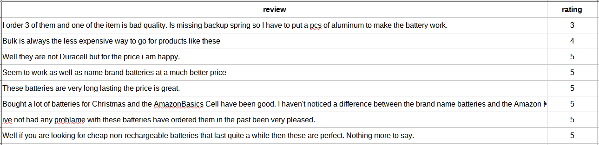

# Rating Prediction of Amazon Reviews using AzureML

## Table of Contents
1- [Overview](#overview)

## Project Overview

In this project we want to use a dataset of reviews and rating from Amazon products to create a machine learning model to classify the rating value (ranging from 1 to 5) of a given review. This task is important since it may be some places where only the text review is available without any numerical rating, so being able to capture a numerical rating for given review is useful to generate reports and plan further actions to improve the customer experience. 

## Dataset

### Overview

The dataset used is a slightly different version of the [Consumer Reviews of Amazon Products](https://www.kaggle.com/datafiniti/consumer-reviews-of-amazon-products) where only the **rating** and **text reviews** fields have been extracted. 

- The **review** field contain customers text reviews about several different products;
- The **rating** field contain the rating that the customer gave to that product.

See below a snippet of the dataset:

This modified dataset is available [here](https://github.com/iolucas/AMLE_P3/raw/main/amazon_reviews.csv).

### Task
We are going to use this dataset to train a machine learning classifier where given a **review** text, the model will predict the correspondent **rating** value for this review. These rating range from 1 (poor product experience) to 5 (awesome product experience).

### Access
To access the dataset within the workspace we are directly downloading it from the web using the method 

`TabularDatasetFactory.from_delimited_files(path="https://github.com/iolucas/AMLE_P3/raw/main/amazon_reviews.csv")`.

## Automated ML
*TODO*: Give an overview of the `automl` settings and configuration you used for this experiment

### Results
*TODO*: What are the results you got with your automated ML model? What were the parameters of the model? How could you have improved it?

*TODO* Remeber to provide screenshots of the `RunDetails` widget as well as a screenshot of the best model trained with it's parameters.

## Hyperparameter Tuning
*TODO*: What kind of model did you choose for this experiment and why? Give an overview of the types of parameters and their ranges used for the hyperparameter search

### Results
*TODO*: What are the results you got with your model? What were the parameters of the model? How could you have improved it?

*TODO* Remeber to provide screenshots of the `RunDetails` widget as well as a screenshot of the best model trained with it's parameters.

## Model Deployment
*TODO*: Give an overview of the deployed model and instructions on how to query the endpoint with a sample input.

## Screen Recording
*TODO* Provide a link to a screen recording of the project in action. Remember that the screencast should demonstrate:
- A working model
- Demo of the deployed  model
- Demo of a sample request sent to the endpoint and its response

## Standout Suggestions
*TODO (Optional):* This is where you can provide information about any standout suggestions that you have attempted.
