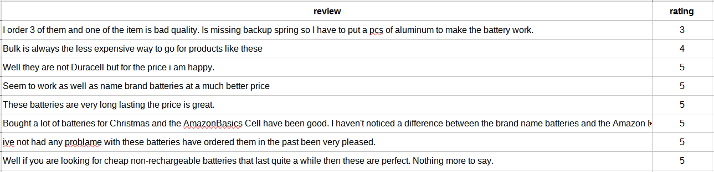
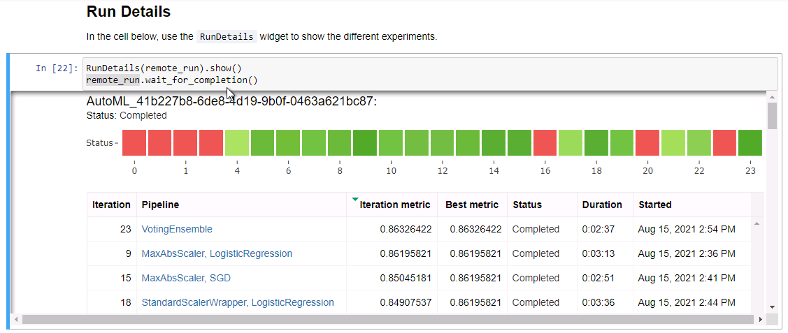
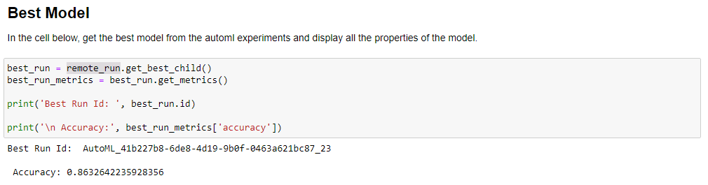
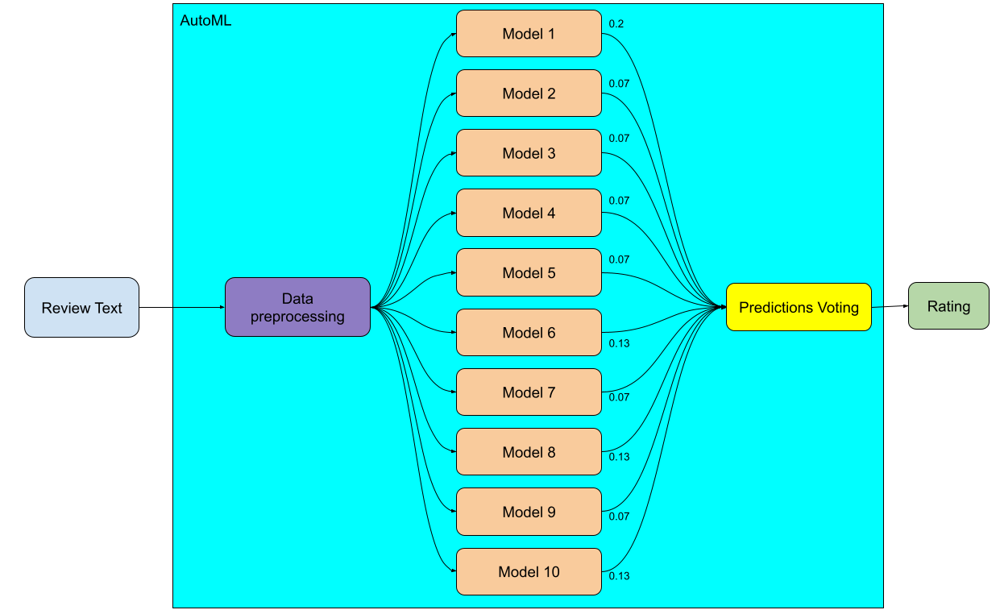
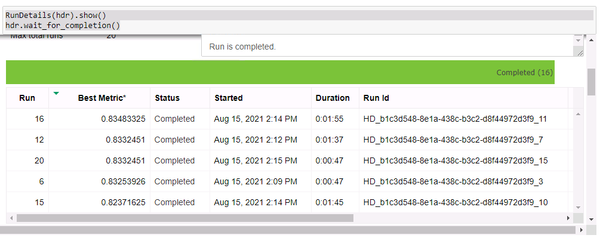
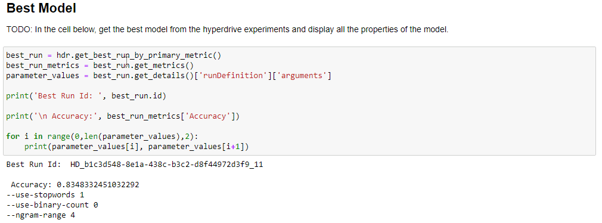
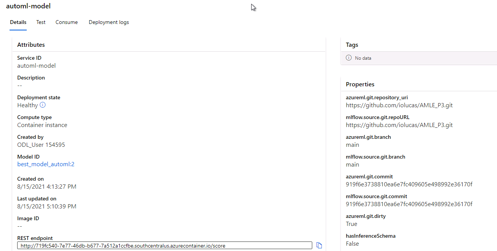

# Rating Prediction of Amazon Reviews using AzureML

## Table of Contents
  - [Project Overview](#project-overview)
  - [Dataset](#dataset)
  - [Automated ML](#automated-ml)
  - [Hyperparameter Tuning](#hyperparameter-tuning)
  - [Model Deployment](#model-deployment)
  - [Screen Recording](#screen-recording)

## Project Overview

In this project we want to use a dataset of reviews and rating from Amazon products to create a machine learning model to classify the rating value (ranging from 1 to 5) of a given review. This task is important since it may be some places where only the text review is available without any numerical rating, so being able to capture a numerical rating for given review is useful to generate reports and plan further actions to improve the customer experience. 

## Dataset

### Overview

The dataset used is a slightly different version of the [Consumer Reviews of Amazon Products](https://www.kaggle.com/datafiniti/consumer-reviews-of-amazon-products) where only the **rating** and **text reviews** fields have been extracted. 

- The **review** field contain customers text reviews about several different products;
- The **rating** field contain the rating that the customer gave to that product.

See below a snippet of the dataset:


Figure 1 - Amazon review dataset sample.

This modified dataset is available [here](https://github.com/iolucas/AMLE_P3/raw/main/amazon_reviews.csv).

### Task
We are going to use this dataset to train a machine learning classifier where given a **review** text, the model will predict the correspondent **rating** value for this review. These rating range from 1 (poor product experience) to 5 (awesome product experience).

### Access
To access the dataset within the workspace we are directly downloading it from the web using the method 

```TabularDatasetFactory.from_delimited_files(path="https://github.com/iolucas/AMLE_P3/raw/main/amazon_reviews.csv")```.

## Automated ML

The AutoML configuration was set as following:
- Experiment timeout: 30 minutes
- Task to be performed: Classification
- Primary metric to optimize: Accuracy
- Target column to predict: rating
- Number of cross validations to perform: 5
- Maximum Concurrent Iterations: 4
- Iteration timeout: 5 minutes
- Iterations to perform: 25


### Results
After 25 iterations the best model found by the AutoML was a VotingEnsemble achieving an accuracy of **0.8633**.


Figure 2 - AutoML run details.


Figure 3 - AutoML best model found.

This Voting essemble is composed of:
- A data preprocessing step
- Ten classifiers with different voting weights

We can se a representation of the found model in the figure below with the models voting weights.


Figure 4 - VotingEnsemble representation.

### Further improvements
There is a few things we can do in order to improve the results gotten here:
- Acquire more training data from diferent product review sources;
- Increase the amount of AutoML iterations;
- Select top performing models found by AutoML and submit them for hyperparameter fine tunning with Hyperdrive.

## Hyperparameter Tuning

In this step of the project select a fixed model and optimize its performance by executing a hyperparameter searching using Hyperdrive trying to maximize the **accuracy** metric.

The model selected was a Naive Bayes together with a Count Vectorizer. This model will work by generating a bag of ngrams of a given review and calculate the joint probability of the ngrams present in a given review to correspond to a given rating. This model has been chosen for its simplicity and effectiveness in small amounts of features, in this case small text reviews.

We can see below a representation of this archicteture:


Figure 5 - Naive Bayes model representation.

The parameters chosen here to be optimized were:
- Whether or not to use stopwords
- The range of ngrams to use
- Whether or not to use binary count

Stopwords are words whose frequency is usually high in a text corpus so the amount of information they carry is small. Example of these words are *by, and, this etc*. Removing them can have the effect of regularize our model (reducing overfitting) however it may the case that some of these words can be relevant for some cases so removing them could also reduce the model performance. For the experiment the set of search values for using stopwords are **1** (true) and **0** (false).

A n-gram is a set of n words that appear together in a text. For example, in the phrase *This product fits perfecly my needs*, the set of 1-gram are *(This, product, fits, perfecly, my, needs)*, whereas the 2-grams are *(This product, product fits, fits perfectly, perfectly my, my needs)*. Using ngrams is important because some words have joint meaning. So the ngram range is the range of ngrams we are going to use while creating our features. If the range is 2, we are going to use 1-grams and 2-grams, if is 3 we will use 1-grams, 2-grams and 3-grams. Increasing the amount of ngrams can improve our model capacity of modelling the data, however it may also generating overfit. For the experiment the set of search values for ngram are **1**, **2**, **3** and **4.

Binary count indicate if we are going to count more than one occurence of the same word or ngram in the same review. For example in the review *I liked this product. It would be great if I had this before.* if the binary count is **false**, the words *I* and *this* would be counted twice. In the other hand, if binary count is **true**, these words would be counted only once. Again, binary counts can help our model understand the data, however can lead to overfitting. For the experiment the set of search values for using binary count are **1** (true) and **0** (false).

Since we have small amounts of hyperparameters to test, the parameter sampling used was a Grid Sampling and the early stopping policy was a Bandit Policy.


### Results
After running the hyperdrive with our model the best accuracy achieved was **0.8348** with the following hyperparameters:
- Use stopwords: 1 (true)
- Use binary count: 0 (false)
- Ngram range: 4


Figure 6 - Details of the Hyperdrive run.


Figure 7 - Best model found after all iterations.

### Further improvements
There is a few things we can do in order to improve the results gotten here:
- Acquire more training data from diferent product review sources;
- Use different models, potentially inclusing ensembles such as Random Forests or Gradient Boosting Trees
- Search for a greater range of ngrams
- Search other hyperparameters like maximum and minimum frequencies of ngrams

## Model Deployment

The best model found was the VotingEnsemble using the AutoML. It has been deployed using ACI with 2 CPUs and 2GB of RAM.


Figure 8 - Running model endpoint.

The expected json format of the request is:

```
{
    "data": [
        "i loved it", 
        "fine product",
        "I hate it",
        "awful"
    ]
}

```

The expected json output is the following:
```[5,5,3,1]```

A sample code for submiting a request for the endpoint is:

```
reviews = [
    "i loved it", 
    "fine product",
    "I hate it",
    "awful experience"
]

predictions = requests.post(scoring_uri, json={
    "data": reviews
}).json()
```


## Screen Recording
A video demo for this project can be seen in this link https://www.youtube.com/watch?v=LzXc3ZkC5f8.
